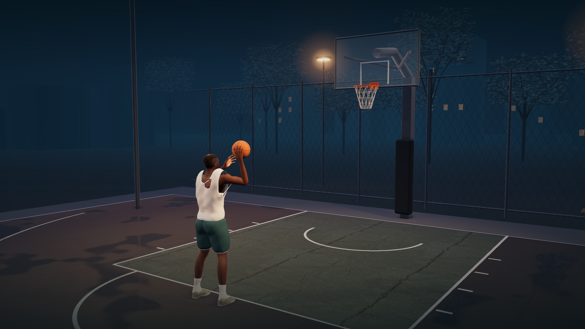

# After Rain

A local, interactive blue-hour free throw: an editable Blender athlete and court, a Three.js viewer, and an explicit gravity-based ball simulation. No footage, accounts, API keys, or network services are needed to play after installing dependencies.



This is a synthetic demonstration with authored movement and hypothetical launch conditions. It does **not** reconstruct Ryan's shot, validate biomechanics, or provide coaching advice.

## Open and play

From a checkout, install dependencies once and launch:

```sh
git clone https://github.com/RyanFDing/basketball-world-lab.git
cd basketball-world-lab
npm ci
npm start
```

Open [localhost:4173](http://127.0.0.1:4173). On this Mac, double-clicking `launch.command` also starts/opens the viewer. Keep its Terminal window open; Control-C stops the server. Chrome with hardware acceleration is the tested browser. Node.js 20.11+ is required; this build was tested with Node 24.3.0. The generated share archive includes the browser's Three.js dependency.

The GitHub repository is private; cloning requires an account with access.

## Controls

| Action | Control |
| --- | --- |
| Play / pause | Button or Space |
| Restart the current shot | Button or R |
| Slow motion | ½× or ¼× |
| Scrub | Drag the six-second timeline; this pauses playback |
| Camera | Cinematic, Orbit, Side, Front |
| Orbit | Drag to rotate, scroll to zoom, right-drag to pan |
| Launch | Speed, elevation, and horizontal direction sliders |
| Trajectory | Optional dashed simulated path, including early contacts |
| Presentation | H or Presentation; Esc restores controls |
| Reset | Default launch, 1× speed, hidden trajectory, cinematic camera, time zero |
| Save / Open | Versioned shot JSON; launch settings also survive a browser refresh |

Positive direction turns the ball toward world +X; zero points straight toward the backboard. JSON saves launch settings, not edits to the athlete, camera, or Blender scene.

## Deliverables

- [Editable scene](deliverables/After%20Rain.blend): modeled athlete, 163-bone rig, sampled six-second animation, ball, court, cameras, lights, and packed textures.
- [20-second 1080p film](deliverables/After-Rain.mp4): three complete 1× takes (courtside, side, front), with no speed ramps and quiet original synthesized ambience. The live viewer is silent.
- [Three 1080p stills](deliverables/stills/).
- Optional archives are generated with `node scripts/package.mjs`: `After-Rain-Project.zip` bundles the local project and Three.js; `After-Rain-Site.zip` contains the static viewer for hosting at a domain root. ZIPs are not committed. Existing local ZIPs predate the anatomy revision until regenerated. HTTP(S) is required, not double-clicking `index.html`. No deployment or paid hosting has been provisioned.

The local URL works only on this Mac; send the MP4 or an archive to share. See [validation](VALIDATION.md) for measured performance and checks, [model notes](MODEL_NOTES.md) for dimensions and approximations, and [asset provenance](ASSET_LICENSES.md).

## Edit or rebuild

Latest September 8 revision: a quick 1.25-second gather-to-release, right-hand carry/launch, and side-only left-hand alignment with no forward release stroke. The lift has no held set-point stage. Playback and all three demo takes run at 1× unless the user explicitly selects slow motion; natural joint/ball acceleration remains. See [motion notes](MODEL_NOTES.md) for the reference and limitations.

The anatomy revision removes excessive elbow folding, separates forearm rotation from wrist bend, coordinates elbow placement with wrist limits, and uses a shallower planted-foot dip. Fingers provide the finishing curl instead of an over-folded wrist. The browser uses the same elbow/wrist objective when launch parameters change. See [joint limits and research](ANATOMY.md); these are conservative authoring choices, not universally valid human limits or validated biomechanics.

Open the `.blend` directly in Blender. The animation runs at 60 fps, frames 1–361; frame 76 is release. Timeline markers identify the shot phases. Skin weights, clothing, cameras and scene objects remain editable. The source rig is a deformation rig; it is not a polished animator-control rig or a motion-capture solve. The supplied script authors analytic limb poses and samples them into keys.

Rebuild from the supplied source assets (the command overwrites generated scene/GLB files; save manual edits under another name first):

```sh
python3 -m venv .venv
.venv/bin/pip install -r requirements.txt
.venv/bin/python scripts/prepare_textures.py
/Applications/Blender.app/Contents/MacOS/Blender -b --python-exit-code 1 --python scripts/build_scene.py -- --render
```

Blender 5.2.1 LTS with Cycles Metal was used. Three.js adds the browser's wet-ground reflections, atmospheric grading, ambient occlusion and gentle foliage motion; its rendering is not pixel-identical to Cycles. `scripts/build_scene.py` generates editable assets and animation; `public/physics.js` is the shared flight model; `public/app.js` coordinates interaction, hand adaptation and rendering.

With the server running, `npm test` checks physics and dimensions; `npm run verify -- --headed` checks the viewer. `node scripts/benchmark.mjs` measures this machine. `node scripts/render_demo.mjs` regenerates the film and stills using Chrome and the project-local Python/FFmpeg dependencies. Shut down other render jobs before benchmarking.

For the focused joint-limit regression only, run `node scripts/verify-anatomy.mjs` with Chrome installed and the server running. It checks the exported clip and the launch-edit window, and saves diagnostic images locally. It does not run the benchmark or the full UI suite.

## First-delivery limits

The character is an authored, game-like athlete, not a photoreal digital human. Clothing and fingers have simplified deformations, especially under extreme parameter changes. The court is a focused single-basket set, not a fully certified regulation installation. There is no cloth or net dynamics solver, coaching analysis, multiplayer, personal-video import, or cloud save. Desktop Chrome is tested; mobile layout is checked, but mobile GPU performance and Safari are not validated.
